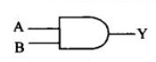
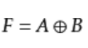
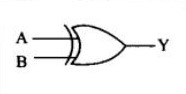
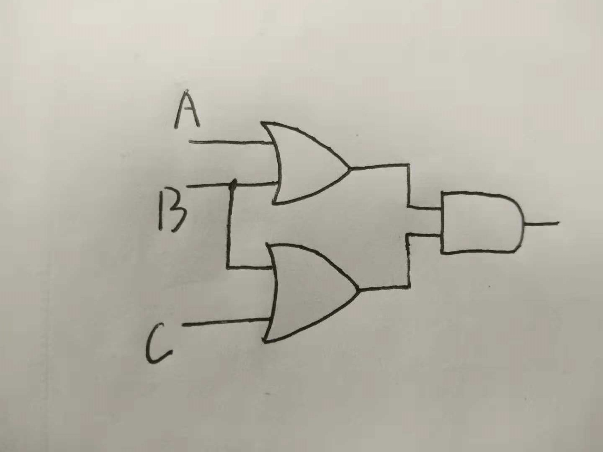
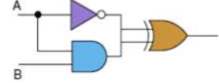
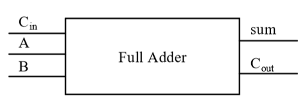
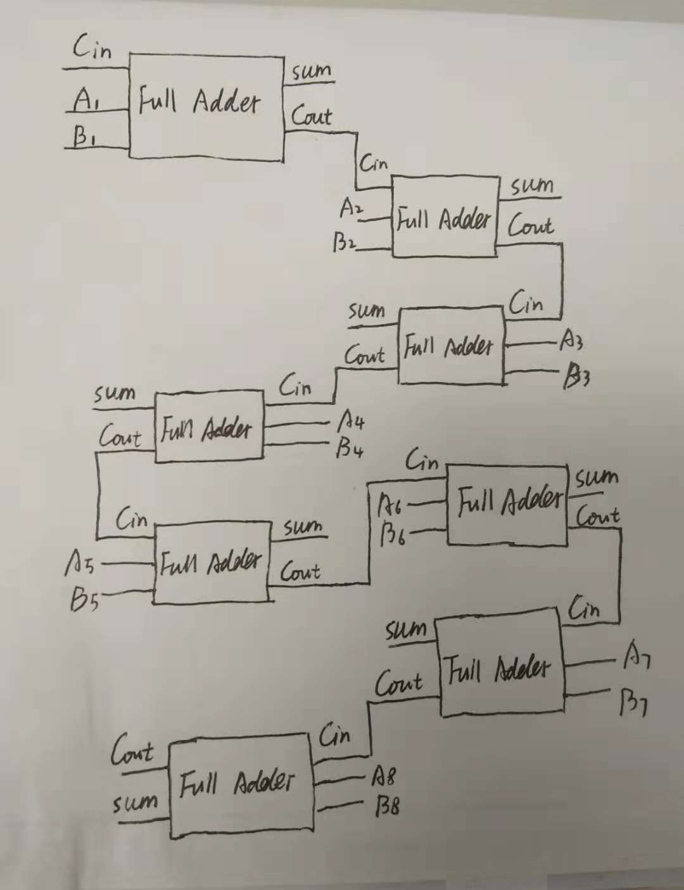

#  HOMEWORK 1
###  1. Give the three representations of an AND gate and say in your words what AND means.
1)布尔表达式：X=A·B

2)逻辑框图符号

3)真值表
| A   | B     | X  |
|:----|:------|:---|
| 0   | 0     | 0  |
| 0   | 1     | 0  |
| 1   | O     | 0  |
| 1   | 1     | 1  |

与门：只有当输入均为1时，输出为1

###  2. Give the three representations of an XOR gate and say in your words what XOR means.

1)布尔表达式

2)逻辑框图符号

3)真值表

| A    | B   | X   |
|:-----|:----|:----|
| 0    | 0   | 0   |
| 0    | 1   | 1   |
| 1    | 0   | 1   |
| 1    | 1   | 0   |

异或门：如果两个输入相同，则输出为0；如果两个输入不同，则输出为1

###  3.Draw a circuit diagram corresponding to the following Boolean expression: (A + B)(B + C) 

###  4. Show the behavior of the following circuit with a truth table:

| A   | B   | X  |
|:----|:----|:---|
| 0   | 0   | 1  |
| 0   | 1   | 1  |
| 1   | 0   | 0  |
| 1   | 1   | 1  |

###  5.What is circuit equivalence? Use truth table to prove the following formula.  (AB)’ = A’ + B’

circuit equivalence:For each input value combination, both circuits produce exactly the same output.

电路等价：对应每个输入的值组合，两个电路都生成完全相同的输出。

(AB)'的真值表：
| A  | B  | X  |
|:---|:---|:---|
| 0  | 0  | 1  |
| 0  | 1  | 1  |
| 1  | 0  | 1  |
| 1  | 1  | 0  |

A'+B'的真值表：
| A  | B  | X  |
|:---|:---|:---|
| 0  | 0  | 1  |
| 0  | 1  | 1  |
| 1  | 0  | 1  |
| 1  | 1  | 0  |

由于对应每个输入的值组合，(AB)'与A'+B'的输出值完全相同，故(AB)'与A'+B'电路等价。

# HOMEWORK 2

 ### 6.There are eight 1bit full adder integrated circuits. Combine them to 8bit adder circuit using the following box diagram.

### 7.Logical binary operations can be used to modify bit pattern. Such as (X8X7X6X5X4X3X2X1)2 and (00001111)2= (0000X4X3X2X1)2 We called that (00001111)2 is a mask which only makes low 4 bits to work. Fill the follow expression 
(1)  (X8X7X6X5X4X3X2X1)2 or (00001111)2 = （X8X7X6X51111)2

(2)  (X8X7X6X5X4X3X2X1)2 xor (00001111)2 = （X8X7X6X5X4'X3'X2'X1')2

(3)  ((X8X7X6X5X4X3X2X1)2 and(11110000)2 ) or  (not (X8X7X6X5X4X3X2X1)2 and (00001111)2)  =  (X8X7X6X5X4'X3'X2'X1')2
 
 # HOMEWORK 3
### 使用维基百科，解释以下概念。 
1)Logic gate：In electronics, a logic gate is an idealized or physical device implementing a Boolean function; that is, it performs a logical operation on one or more binary inputs and produces a single binary output.

2)Boolean algebra:In mathematics and mathematical logic, Boolean algebra is the branch of algebra in which the values of the variables are the truth values true and false, usually denoted 1 and 0 respectively. Instead of elementary algebra where the values of the variables are numbers, and the prime operations are addition and multiplication, the main operations of Boolean algebra are the conjunction and denoted as ∧, the disjunction or denoted as ∨, and the negation not denoted as ¬. It is thus a formalism for describing logical relations in the same way that elementary algebra describes numeric relations. 

### 维基百科：“Flip-flop”，选择中文：
#### 1)Flip-flop 中文翻译是？
触发器
#### 2)How many bits information does a SR latch store?
1